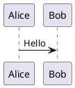

# Diagramas

Para hacer diagramas las herramientas mas usadas son:

1. Mermaid.js
2. PlantUML

El primero es compatible al 100% con markdown, el segundo es mas
fuerte y completo pero es menos compatible.


## PlantUML

Como compatibilizar con markdown.

```bash
pip install mkdocs mkdocs-material mkdocs-plantuml-plugin
```

```yml
plugins:
  - plantuml:
      server: http://www.plantuml.com/plantuml  # o local si tienes PlantUML

```



Se puede usar el servicio:

```md

```

## Tikz

Es un paquete de latex. Va bombeta
